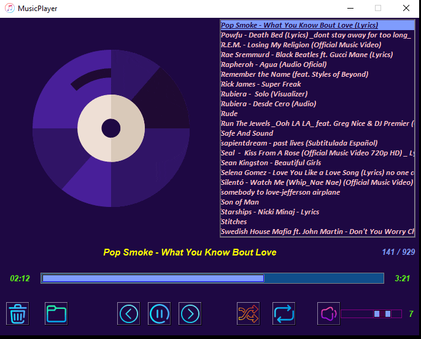

# MusicPlayer Python

This is a Music Player made in Python with the Modules Pygame, Tkinter, Mutagen, Eyed3, Random, os.

## Graphic Interface

### Launch Music Player

### Button Open File

### Button Delete Playlist

### Button Play

### Button Pause

### Button Previous

### Button Next

### Control Volume

### Button Mute

### Button Shuffle

### Button Repeat

---

### 💡 This is a Multi-Functioning Music Player, a Basic Project in Python 💡

### ➡️ ***Features are:-***

- #### **Play Song**

- #### **Pause Song**

- #### **Mute a Song**

- #### **Volume Song**

- #### **Play Next Song**

- #### **Play Previous Song**

- #### **Shuffle**

- #### **Repeat**

- #### **Add Songs to the Playlist**

- #### **Count the Total Song in the Playlist**

- #### **Live Song Duration**

- #### **DoubleClick a Song**

- #### **Delete Playlist**

---

### ⚒️ ***Python Module Used Here:-***

- #### **Tkinter**

- #### **Pygame**

- #### **Mutagen**

- #### **Eyed3**

- #### **os**

- #### **Random**

---

### 🎯 **Module That you have to Install Manually:-**

### 1. **Pygame**

Pygame is a free and open-source cross-platform library for the development of multimedia applications like video games using Python. It uses the Simple DirectMedia Layer library and several other popular libraries to abstract the most common functions, making writing these programs a more intuitive task.

#### 🎯 Install Pygame by writing `pip install pygame` in your ***cmd or Terminal***

🎯
[To see Pygame Documentation Click Here](https://pypi.org/project/pygame/)

### 2. **Mutagen**

Mutagen is a Python module to handle audio metadata. It supports ASF, FLAC, MP4, Monkey’s Audio, MP3, Musepack, Ogg Opus, Ogg FLAC, Ogg Speex, Ogg Theora, Ogg Vorbis, True Audio, WavPack, OptimFROG, and AIFF audio files. All versions of ID3v2 are supported, and all standard ID3v2.4 frames are parsed. It can read Xing headers to accurately calculate the bitrate and length of MP3s. ID3 and APEv2 tags can be edited regardless of audio format. It can also manipulate Ogg streams on an individual packet/page level.

#### 🎯 Install Mutagen by writing `pip install mutagen` in your ***cmd or Terminal***

🎯
[To see Mutagen Documentation Click Here](https://pypi.org/project/mutagen/)

### 3. **Eyed3**

eyeD3 is a Python tool for working with audio files, specifically MP3 files containing ID3 metadata (i.e. song info). It provides a command-line tool ( eyeD3 ) and a Python library ( import eyed3 ) that can be used to write your own applications or plugins that are callable from the command-line tool.

#### 🎯 Install eyed3 by writing `pip install eyed3` in your ***cmd or Terminal***

🎯
[To see Eyed3 Documentation Click Here](https://pypi.org/project/eyed3/)
